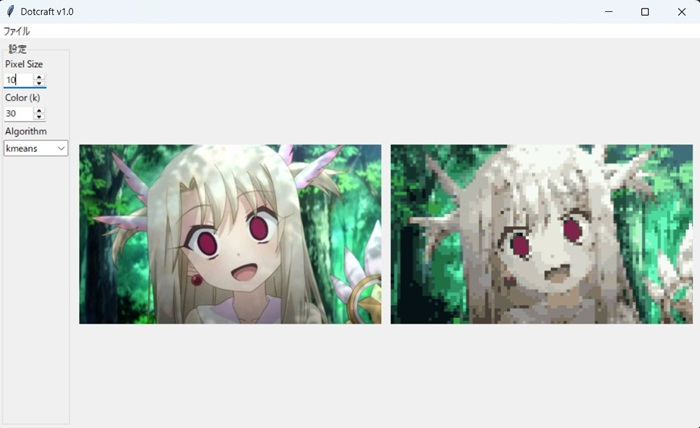

# Dot-Craft
## 概要
Dot-Craftは、元画像とドット絵化された画像を並べて表示し、リアルタイムでパラメータを調整できるGUIアプリケーションです。
3つの異なる色数減少アルゴリズム（K-means、Median Cut、Octree）を選択できます。

## 主な機能

- **リアルタイムプレビュー**: パラメータ変更時に200msのデバウンス処理でスムーズな更新
- **ドラッグ&ドロップ対応**: tkinterdnd2ライブラリによる画像ファイルの直接ドロップ
- **3つのアルゴリズム**: K-means、Median Cut、Octreeから選択可能 

## パラメータ

- **Pixel Size**: ドットのサイズ（2-100）
- **Color (k)**: 色数（2-32）
- **Algorithm**: 色数減少アルゴリズム（kmeans/median/octree）

## 著作権表示
© 2025 ARM